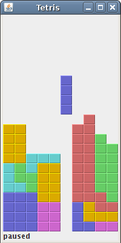

 ->

<-
      

# Introduction

A java project called "a simple game of tetris". It was a final project for the last part of Java programming class in Indiana
University. The game might seems simple but the features visualized for a tetris game is suitable for an object-oriented language.
This is because there are many classifications in a tetris such as lines, blocks, color, moves and etc, that would required to be 
pre-defined before going into building the fundamentals of "playing a tetris game". 

# Features
* blocks of different color to better visualize the difference when playing a game of tetris.
  Implemented by using the Java GUI feature.
* navigation by left, right, up, down button. Implemented by using Java GUI feature.
* End function to end the game of tetris.